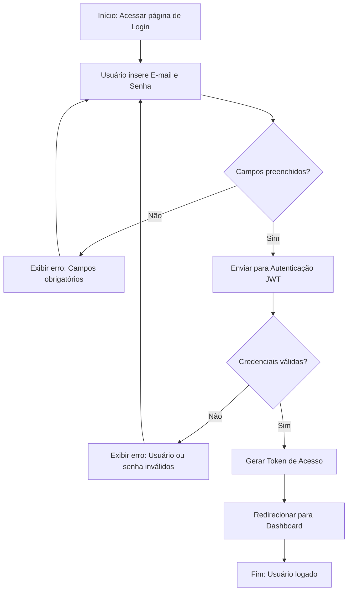

```mermaid

graph TD
    A[Início: Acessar página de Login] --> B[Usuário insere E-mail e Senha]
    B --> C{Campos preenchidos?}
    C -- Não --> D[Exibir erro: Campos obrigatórios]
    D --> B
    C -- Sim --> E[Enviar para Autenticação JWT]
    E --> F{Credenciais válidas?}
    F -- Não --> G[Exibir erro: Usuário ou senha inválidos]
    G --> B
    F -- Sim --> H[Gerar Token de Acesso]
    H --> I[Redirecionar para Dashboard]
    I --> J[Fim: Usuário logado]
```