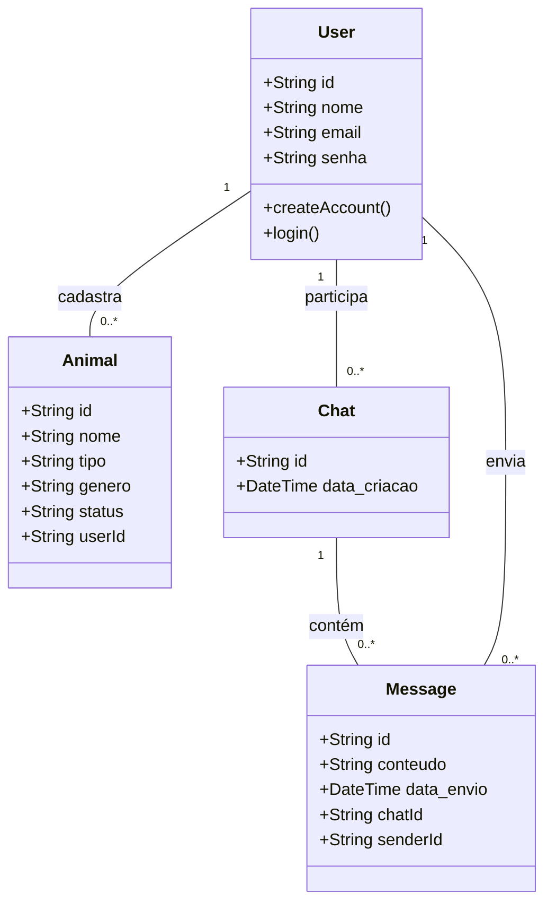

```mermaid

classDiagram
    class User {
        +String id
        +String nome
        +String email
        +String senha
        +createAccount()
        +login()
    }

    class Animal {
        +String id
        +String nome
        +String tipo
        +String genero
        +String status
        +String userId
    }

    class Chat {
        +String id
        +DateTime data_criacao
    }

    class Message {
        +String id
        +String conteudo
        +DateTime data_envio
        +String chatId
        +String senderId
    }

    User "1" -- "0..*" Animal : cadastra
    User "1" -- "0..*" Chat : participa
    Chat "1" -- "0..*" Message : contém
    User "1" -- "0..*" Message : envia
```