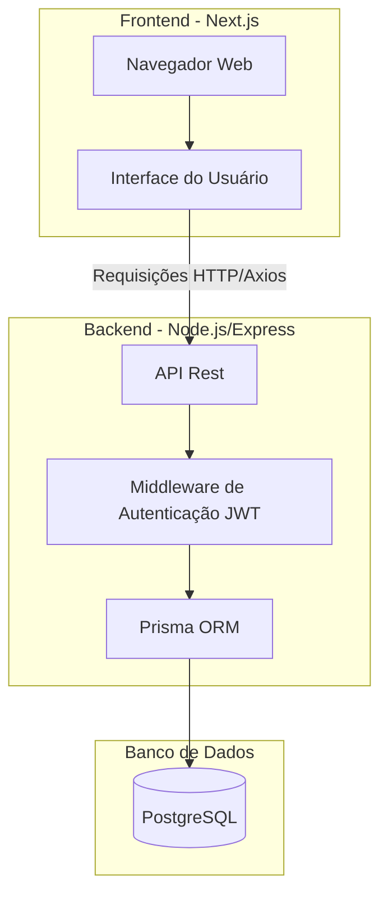

```mermaid

graph TD
    subgraph Client_Side [Frontend - Next.js]
        WebBrowser[Navegador Web]
        UI[Interface do Usuário]
    end

    subgraph Server_Side [Backend - Node.js/Express]
        API[API Rest]
        Auth[Middleware de Autenticação JWT]
        ORM[Prisma ORM]
    end

    subgraph Data_Layer [Banco de Dados]
        DB[(PostgreSQL)]
    end

    WebBrowser --> UI
    UI -->|Requisições HTTP/Axios| API
    API --> Auth
    Auth --> ORM
    ORM --> DB
```    