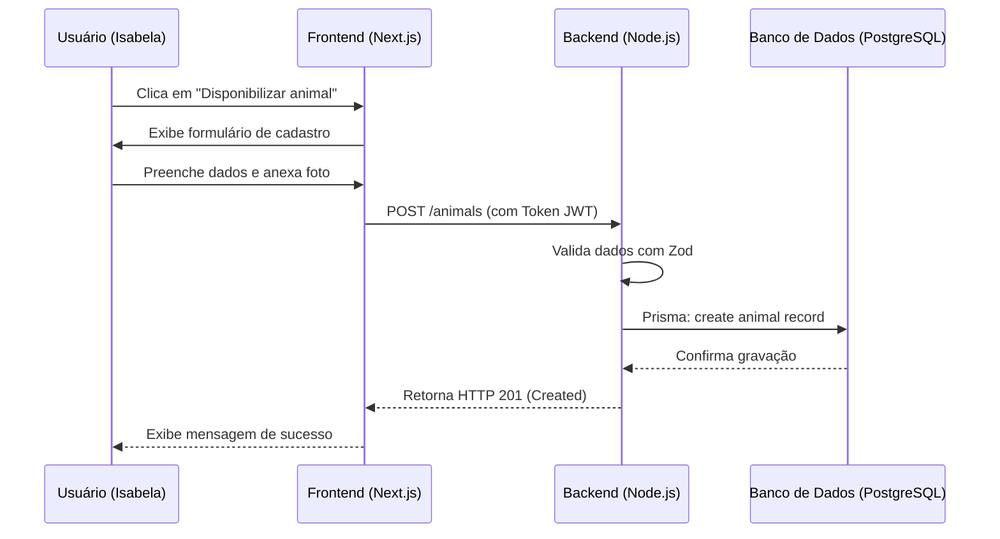

```mermaid

sequenceDiagram
    participant U as Usuário (Isabela)
    participant F as Frontend (Next.js)
    participant B as Backend (Node.js)
    participant DB as Banco de Dados (PostgreSQL)

    U->>F: Clica em "Disponibilizar animal"
    F->>U: Exibe formulário de cadastro
    U->>F: Preenche dados e anexa foto
    F->>B: POST /animals (com Token JWT)
    B->>B: Valida dados com Zod
    B->>DB: Prisma: create animal record
    DB-->>B: Confirma gravação
    B-->>F: Retorna HTTP 201 (Created)
    F-->>U: Exibe mensagem de sucesso
```